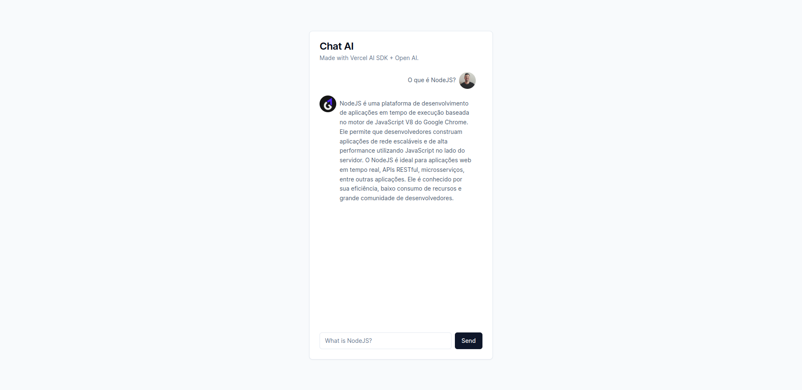

<h3 align="center">
  Chat LLM AI 🤖
</h3>


<p align="center">
	
</p>

## 📌 Overview

That's a simple chat integrated with OpenAI API with help of Vercel AI SDK. 

## 🔧 Technologies

- Typescript
- NextJS
- ReactJS
- Vercel AI SDK
- OpenAI API
- shadcn-ui
- Tailwind

## 🚀 Getting started

1. Clone this repository
2. Run the following commands
```sh
npm install
npm run dev
```
